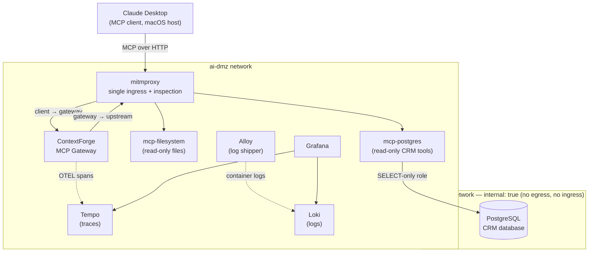

# MCP Security Lab

A self-contained, Docker-based lab for exploring the **security and observability** of
Model Context Protocol (MCP) tool use. It puts an AI client (Claude Desktop) in front of
real MCP servers behind a governed gateway, with full traffic inspection, distributed
tracing, and deterministic PII masking — so you can *see*, layer by layer, what actually
happens when an AI calls a tool against a business system.

Built and tested on Apple Silicon (all images are arm64-native or built locally).

Built as a hands-on learning project with significant use of AI assistance (Claude) for architecture guidance and debugging; the design decisions, troubleshooting, and integration were my own

---

## Why this exists

"Give the AI access to our database" is a sentence that hides a lot of security questions.
This lab makes those questions concrete and demonstrable:

- Where does AI tool traffic actually go, and who can inspect it?
- What stops a tool from reaching the open internet, or from writing to the database?
- How do you govern, authenticate, and audit tool calls at a single choke point?
- How do you keep sensitive data (PII) from leaking back to the model — *deterministically*,
  not just by hoping the model declines?

Every one of those is wired up here as something you can run and watch live.

---

## Architecture



Two Docker networks form the trust boundary:

- **`ai-internal`** is declared `internal: true`, so containers on it have **no route to
  the internet and cannot be reached from the host**. The CRM database lives only here —
  it has zero external exposure. (Provable live: `docker exec lab-postgres getent hosts google.com` fails.)
- **`ai-dmz`** is where the MCP servers and gateway live. Only **mitmproxy** publishes
  ports, making it the single ingress — a deliberate, hands-on preview of the gateway pattern.

`mcp-postgres` is intentionally **dual-homed** (dmz + internal), exactly like a proxy/firewall
tier in a classic DMZ design: reachable from the dmz, able to reach the database, holding only
a read-only credential.

---

## Security concepts demonstrated

| Concept | How it's shown here |
|---|---|
| **Network segmentation** | `internal: true` isolates the database — no egress, no ingress |
| **Single ingress / choke point** | mitmproxy is the only service that publishes ports |
| **Full traffic inspection** | Two-hop reverse proxy: one tool call = two flows in mitmweb |
| **Least privilege at the data tier** | The MCP server holds a `SELECT`-only Postgres role |
| **Defense in depth in the tool layer** | Read-only tools, single-`SELECT` guard, read-only session — *and* the DB role behind it all |
| **Gateway governance** | ContextForge enforces auth (JWT), centralizes registration and policy |
| **Deterministic PII masking** | A gateway plugin masks SSNs/emails in tool payloads, independent of the model |
| **Layered guardrails** | The model declines to surface PII *and* the gateway redacts it before the model ever sees it |

---

## Observability & PII masking (the extension work)

On top of the base lab, the gateway is instrumented end to end:

- **Distributed tracing** — ContextForge exports OpenTelemetry spans to **Tempo**, viewable in
  **Grafana**. A custom telemetry-exporter plugin captures the **full tool-call payload**
  (`tool.invocation.args` / `tool.invocation.result`) plus identity (`user`, `tenant_id`,
  `server_id`) as span attributes.
- **PII masking at the gateway** — a PII-filter plugin runs *ahead* of the exporter (lower
  priority number = runs first), so it masks SSNs and emails **before** they're captured into a
  trace and **before** they're returned to the model. You can watch the same value appear
  redacted at both the `tool_pre_invoke` gate (arguments) and the `tool_post_invoke` gate (results).
- **Log aggregation** — **Grafana Alloy** ships every container's logs into **Loki**, giving a
  searchable, historical view of gateway identity/auth events alongside the traces.

The teachable contrast: model-side guardrails are probabilistic and bypassable, while the
gateway-side PII control is deterministic — it fires regardless of which client called or how the
prompt was phrased. Both firing together is defense in depth; the gateway is the layer you can
actually depend on.

---

## Components

| Service | Image / build | Role |
|---|---|---|
| `postgres` | `postgres:17` | CRM database, internal network only |
| `mcp-postgres` | built locally (FastMCP) | CRM MCP server: `list_tables`, `describe_table`, `find_customer`, `run_query` (read-only) |
| `mcp-filesystem` | built locally | Reference filesystem MCP server over HTTP, read-only file share |
| `contextforge` | `ghcr.io/ibm/mcp-context-forge` | MCP gateway: auth, registration, plugins, OTEL |
| `mitmproxy` | `mitmproxy/mitmproxy` | Single ingress + two-boundary traffic inspection |
| `tempo` | `grafana/tempo` | Trace storage |
| `loki` | `grafana/loki` | Log storage |
| `alloy` | `grafana/alloy` | Log collection (Docker → Loki) |
| `grafana` | `grafana/grafana` | Traces + logs UI |

---

## Quickstart

**Prerequisites:** Docker on macOS/Linux. Apple Silicon supported.

```bash

# 1. Bring up the stack
docker compose up -d

# 2. Watch it come up
docker compose ps
```

**Endpoints (all loopback-bound):**

| URL | What |
|---|---|
| http://localhost:4444 | ContextForge Admin UI |
| http://localhost:8081 | mitmweb traffic inspector (password in compose) |
| http://localhost:3000 | Grafana (traces + logs) |

Point Claude Desktop at the gateway through mitmproxy, then try a tool call and watch it appear simultaneously in mitmweb (two flows) and Grafana (a span).

### See the PII masking

1. Ask the client to look up a customer (e.g. *"pull up the full record for Henderson Industrial"*).
2. In Grafana → Explore → **Tempo**, open the span and read `tool.invocation.result`.
3. Email/SSN values come back **partially masked** — redacted by the gateway plugin before the
   model ever received them.

---

## Notes & caveats

- **Credentials in this repo are intentionally throwaway lab values** (every secret is suffixed
  to make that obvious). They exist so the lab is clone-and-run; they are not a pattern for
  production. In a real deployment these move to a secret manager and the database isn't seeded
  with a default admin.
- The gateway image is pinned to a release-candidate tag for reproducibility; newer versions may
  change plugin behavior or configuration keys.
- This is a learning lab, optimized for *visibility* over hardening (anonymous Grafana, plaintext
  HTTP internally, a single gateway worker). Those are deliberate simplifications, called out so
  the trade-offs are explicit.

---

## Acknowledgements

Built on excellent open-source work: [IBM ContextForge](https://github.com/IBM/mcp-context-forge),
[mitmproxy](https://mitmproxy.org/), the [Grafana](https://grafana.com/) stack (Tempo, Loki, Alloy),
[FastMCP](https://github.com/jlowin/fastmcp), and the MCP reference servers.

## License

Released under the MIT License — see LICENSE.
